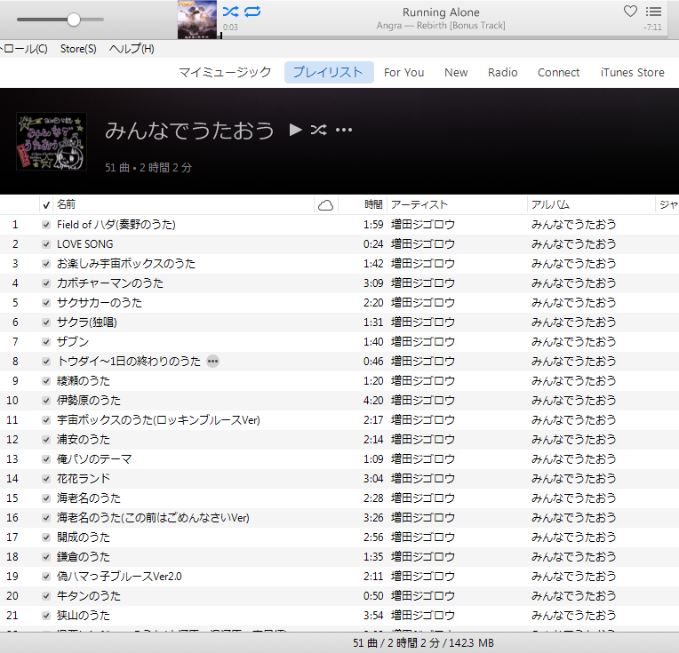

# ReplaceFont
## Description
Good-by bitmap font. This script replace font in TextStyle.plist for ja.

## Usage
   1. Download this script.
   2. cd folder that you saved this script.
   3. ./ReplaceFont.ps1 arial
   4. Open iTunes for Windows.

## Licence
Copyright (c) 2016 tkumata

This software is released under the MIT License, please see [MIT](http://opensource.org/licenses/mit-license.php)

## Author
[tkumata](https://github.com/tkumata/)
